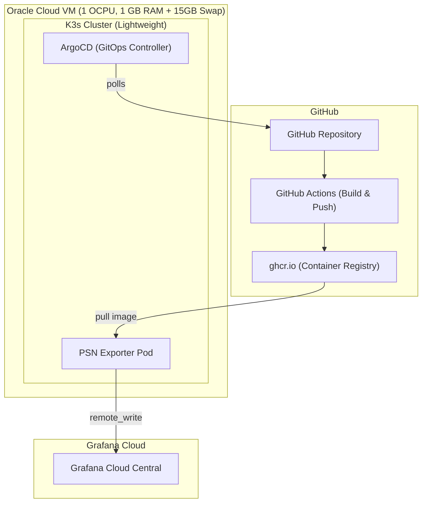

# PSN Exporter → Grafana Cloud (GitOps Architecture)

This repository contains a fully automated, GitOps-driven deployment for a PlayStation Network (PSN) data exporter. It runs on a lightweight Kubernetes (K3s) cluster managed by ArgoCD, and pushes metrics directly to Grafana Cloud.

## 🌟 The Challenge: 1GB RAM

This architecture was specifically designed to run on the **Oracle Cloud Always Free `VM.Standard.E2.1.Micro` instance**, which provides only **1 OCPU and 1GB of RAM**. 

Running standard Kubernetes and ArgoCD on 1GB of RAM usually results in Out-Of-Memory (OOM) crashes. To solve this, this repository implements three critical optimizations:
1. **15GB Swap File**: Repurposes free hard drive space into virtual RAM to prevent OOM errors.
2. **Stripped-down K3s**: Disables heavy built-in components (Traefik, ServiceLB, Metrics Server).
3. **Direct Grafana Push**: Eliminates the need for an in-cluster Prometheus database by pushing metrics directly to Grafana Cloud via the `prometheus-remote-writer` Python library.

---

## 🏗️ Architecture



---

## 🚀 Getting Started

### 1. Provision Infrastructure
We use Terraform to automatically build the Oracle Cloud Virtual Machine with the correct networking and firewall rules.
```bash
cd terraform-oci
terraform init
terraform apply -var="compartment_ocid=<YOUR_OCID>" -var="ssh_public_key_path=~/.ssh/id_ed25519.pub"
```

### 2. Bootstrap the VM
Once the VM is created, SSH into it and run the bootstrap script to create the Swap file and install K3s and ArgoCD:
```bash
ssh ubuntu@<VM_PUBLIC_IP>
bash <(curl -s https://raw.githubusercontent.com/<your-repo>/scripts/bootstrap-vm.sh)
```

### 3. CI/CD Pipeline
Any code pushed to the `main` branch will automatically trigger a GitHub Actions workflow that:
1. Lints and tests the Python exporter.
2. Builds a multi-arch Docker image.
3. Pushes the image to GitHub Container Registry (`ghcr.io`).

ArgoCD will automatically detect the new image and roll it out to the K3s cluster.
